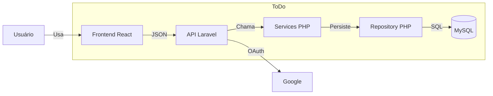

# C4 de contêiner — versão A (prompt curto)

Prompt usado: “Gere um diagrama C4 de contêiner deste ToDo.”

Sem `AGENTS.md`, sem portas Docker e sem a entidade de domínio. O agente inventou um banco relacional genérico, promoveu Service e repositório a contêiner e omitiu GitHub e o cookie de sessão.

Imagem: `c4-container-v1.png` (abra o arquivo se o Mermaid C4 não renderizar no editor).

