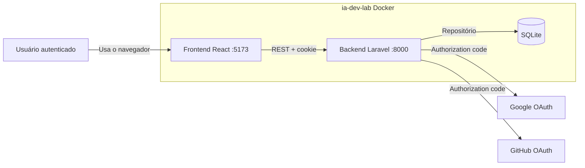

# C4 de contêiner — versão B (contexto do laboratório + ajuste)

Prompt usado: os dois processos do Docker, portas 5173 e 8000, REST com cookie, SQLite, Google e GitHub, `IdentityProviderInterface`, `App\Domain\Task` *dentro* do backend (não é contêiner). Ajuste manual: retirei qualquer caixa de Service/Eloquent e deixei o SQLite como único banco.

Imagem: `c4-container-v2.png` (abra o arquivo se o Mermaid C4 não renderizar no editor).

